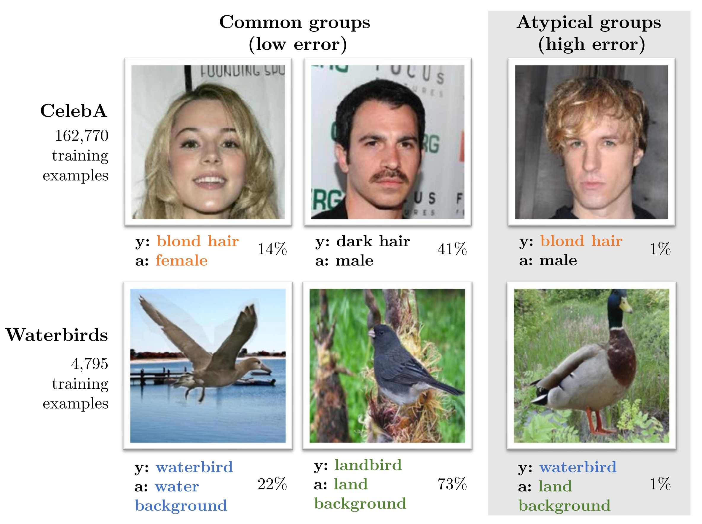

# SpuCo (Spurious Correlations Datasets and Benchmarks)

[](https://spuco.readthedocs.io/en/latest/?badge=latest)

SpuCo is a Python package developed to further research to address spurious correlations. Spurious correlations arise when machine learning models learn to exploit *easy* features that are not predictive of class membership but are correlated with a given class in the training data. This leads to catastrophically poor performance on the groups of data without such spurious features at test time.



Link to Paper: https://arxiv.org/abs/2306.11957

The SpuCo package is designed to help researchers and practitioners evaluate the robustness of their machine learning algorithms against spurious correlations that may exist in real-world data. SpuCo provides:

- Modular implementations of current state-of-the-art (SOTA) methods to address spurious correlations
- SpuCoMNIST: a controllable synthetic dataset that explores real-world data properties such as spurious feature difficulty, label noise, and feature noise
- SpuCoAnimals: a large-scale vision dataset curated from ImageNet to explore real-world spurious correlations

> Note: This project is under active development.

# Quickstart

Refer to quickstart for scripts and notebooks to get started with *SpuCo*

Google Colab Notebooks: 

- [Explore Data](https://colab.research.google.com/drive/1jwZJ27gTh2t9V3rY6Co-oSIeUvCt3php?authuser=1>)
- [SpuCoMNIST GroupDRO](https://colab.research.google.com/drive/1LXAwbkIt4nryI6K6OYhv7zo3LRNmBCW0?authuser=1>)
- [SpuCoMNIST EIIL](https://colab.research.google.com/drive/1Ut3BCeCV7DFQ2BUF01gqxZwTEJPIh5Cj?authuser=1>)


## Installation

```python
pip install spuco
```

Requires >= Python 3.10

## About Us

This package is maintained by [Siddharth Joshi](https://sjoshi804.github.io/) from the BigML group at UCLA, headed by [Professor Baharan Mirzasoleiman](http://web.cs.ucla.edu/~baharan/group.htm).

