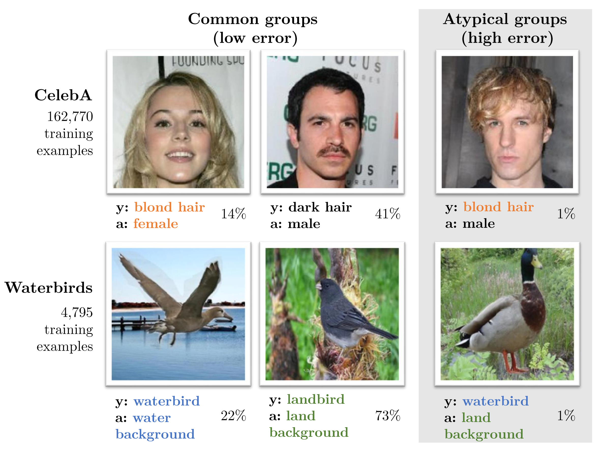

============
SpuCo
============

**SpuCo** is a Python package developed to further research to address *spurious correlations*. 
Spurious correlations arise when machine learning models learn to exploit *easy* features that are not 
predictive of class membership but are correlated with a given class in the training data. This leads
to catastrophically poor performance on the groups of data without such *spurious* features at test time. 

The SpuCo package is designed to help researchers and practitioners evaluate
the robustness of their machine learning algorithms against spurious
correlations that may exist in real-world data. SpuCo provides:

- Modular implementations of **current SOTA** to address spurious correlations
- **SpuCoMNIST**: a controllable synthetic dataset that explores real-world data properties such as spurious feature difficulty, label noise and feature noise. 
- **SpuCoAnimals**: a large-scale vision dataset curated from ImageNet to explore real-world spurious correlations

Link to GitHub: https://github.com/BigML-CS-UCLA/SpuCo

.. note::

   This project is under active development.

----------------
Getting Started
----------------

.. toctree::
   :caption: User Guide
   :maxdepth: 2

   user-guide/overview
   user-guide/datasets

.. toctree::
   :caption: API Reference
   :maxdepth: 1
   :glob:

   reference/*

About Us
--------
This package is maintained by `Siddharth Joshi <https://sjoshi804.github.io/>`_  from the BigML group at UCLA headed by `Professor Baharan Mirzasoleiman <http://web.cs.ucla.edu/~baharan/group.htm>`_.