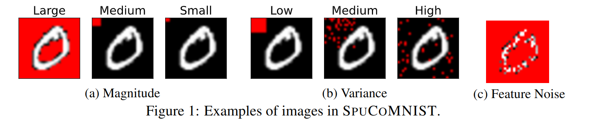
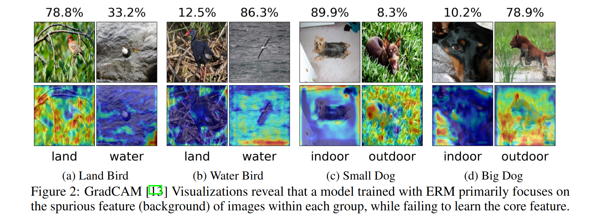

=========
Datasets
=========

The package currently provides the following datasets:

- *SpuCoMNIST*: A controllable synthetic dataset that explores real-world data properties (spurious feature: colored background, core feature: MNIST digit)
- *SpuCoAnimals*: A large-scale vision dataset curated from ImageNet to explore real-world spurious correlations (spurious feature: background, core_feature: animal)

-----------
SpuCoMNIST 
-----------

*SpuCoMNIST* allows controllable:

- *number of classes and size of classes*: digits can be grouped to form classes of SpuCoMNIST (e.g. [0,1] [2,3] [4,5] [6,7] [8,9])
- *spurious feature magnitude*: large magnitude = easier to learn, small magnitude = harder to learn
- *spurious feature variance*: low variance = easier to learn, high variance = harder to learn
- *label noise*: proportion of examples with incorrect labels 
- *feature noise*: proportion of examples with corrupted core feature i.e. digit

-------------
SpuCoAnimals
-------------

Next, we introduce SpuCoAnimals, a large-scale vision dataset curated from ImageNet with **two realistic spurious correlations**. 

*SpuCoAnimals* has 4 classes: 

- landbirds
- waterbirds
- small dog breeds
- big dog breeds.

Waterbirds and Landbirds are spuriously correlated with *water* and *land* backgrounds, respectively. Small dogs and big dogs are spuriously correlated with *indoor* and *outdoor* backgrounds, respectively.

---------
SpuCoDogs
---------

Subset of SpuCoAnimals containing only dogs. 

----------
SpuCoBirds
----------

Subset of SpuCoAnimals containing only birds. 